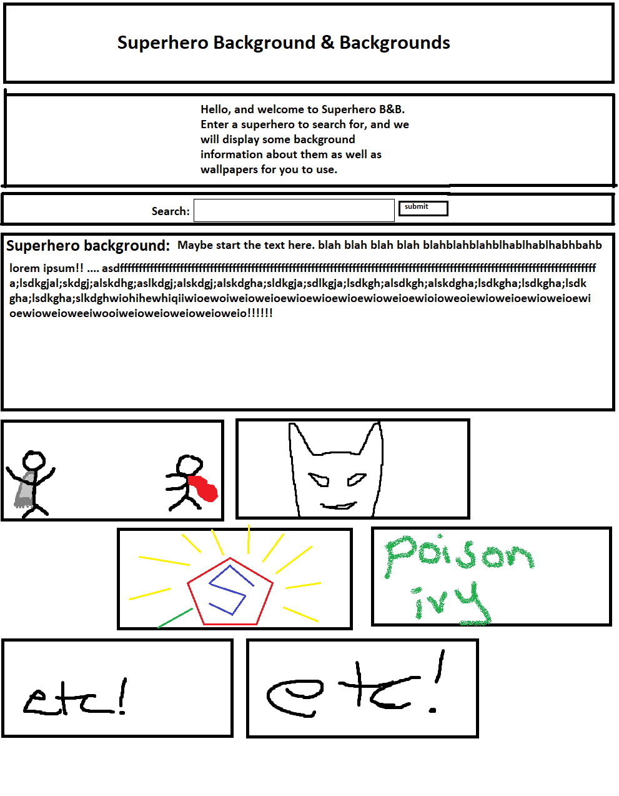
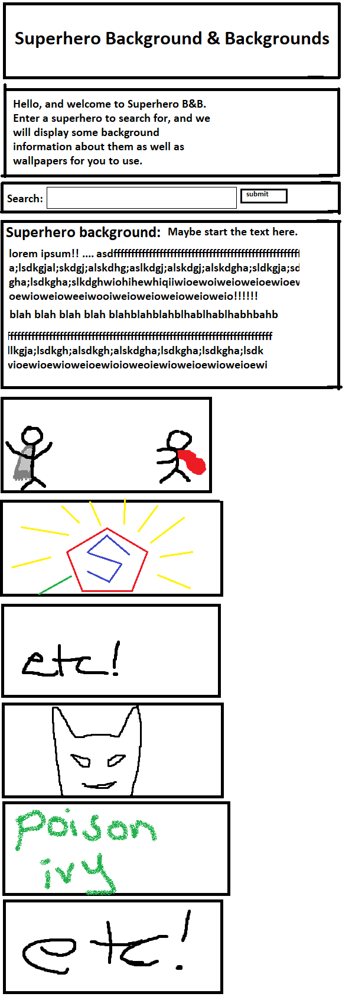

# Superhero Background & Backgrounds

## Description
This project will take a superhero name from the user and will return information about them, and will also return wallpapers related to the superhero.

## User Story
```
AS a fan of superheroes that would like more information and wallpapers of them
I WANT an app that displays information and wallpapers about a superhero I search for
SO THAT I can read about the superhero and change my wallpaper
```


## Wireframe
```
Browser:
```

```
Mobile first (responsive):
```



## APIs Used
* SuperheroAPI.com
* Wallhaven API


## Tasks

1) After the wireframe, create the mock up 
2) Design the HTML/CSS
3) We need to set up a front end UI that can take in an input from the user:
    * Superhero name
4) Once we have this search information, we will use the backend to communicate with the APIs and return back:
    * Superhero information
    * Wallpapers closely related to said superhero
5) Integrate with Javascript
