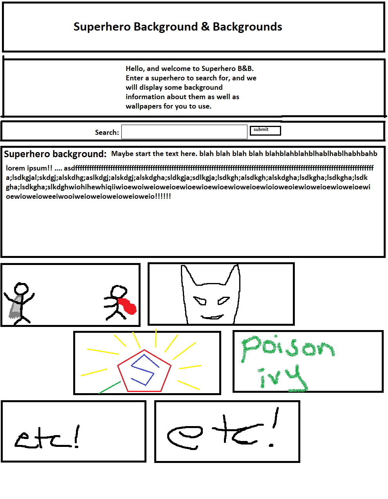
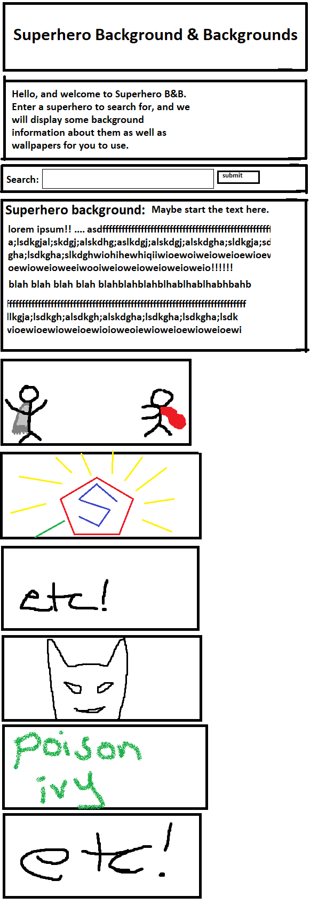
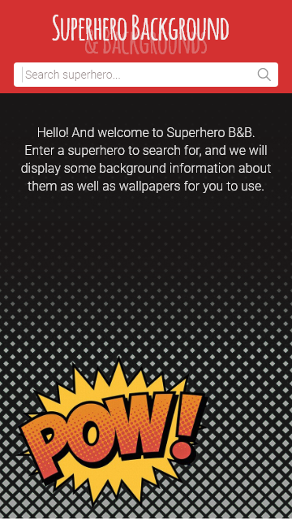
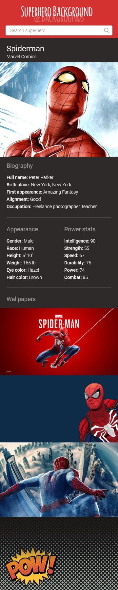

# Project 1: Superhero Background & Backgrounds
> A mobile-first application that allows superhero fanatics to view their favorite heroes' informations.

## Description
This was a group project where we built a mobile-first application that will run in the browser and feature dynamically updated HTML and CSS. We were tasked with retrieving data from at least 2 APIs and using them to create an app. Our app will take a superhero name from the user and will return information about them, and will also return wallpapers related to the superhero. We used [Superhero API](https://superheroapi.com/index.html) to retrieve data about superheroes and [Unsplash API](https://unsplash.com/developers) to retrieve images from.

## User Story

```
AS A fan of superheroes
I WANT information and wallpapers about a superhero
SO THAT I can read about the superhero and change my wallpaper
```

## Acceptance Criteria

```
GIVEN the application
WHEN I arrive on the home screen
THEN I am presented with an animation telling me about the application
WHEN I submit a search query
THEN the page reloads and views information about the superhero
WHEN I receive multiple results for a search query
THEN the page presents me with buttons to browse through them
WHEN I click on a button of a multiple search result
THEN I am presented with the information of another result
WHEN I scroll down even more
THEN I am presented with images of wallpapers related to the superhero
```

## Wireframe
```
Browser:
```

```
Mobile first (responsive):
```


## Mockups
Interactive Mockup: [Interactive Mockup](https://xd.adobe.com/view/192bda5d-598a-4139-731f-c3254e11c316-6f1a/)





## Deployed Application
[Superhero Background & Backgrounds](linkHere)

## Screenshots


## APIs Used
* [Superhero API](https://superheroapi.com/index.html)
* [Unsplash API](https://unsplash.com/developers)


## Tasks
1) After the wireframe, create the mock up 
2) Design the HTML/CSS
3) We need to set up a front end UI that can take in an input from the user:
    * Superhero name
4) Once we have this search information, we will use the backend to communicate with the APIs and return back:
    * Superhero information
    * Wallpapers closely related to said superhero
5) Integrate with Javascript
